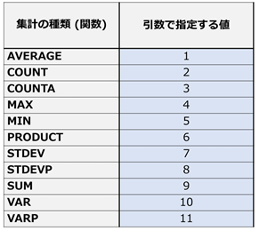
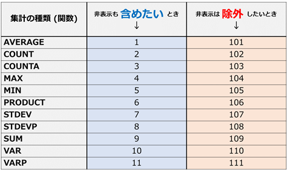

<!-- TOC START min:1 max:3 link:true asterisk:false update:true -->
- [フィルタ後のデータを対象に数式を実行する](#フィルタ後のデータを対象に数式を実行する)
  - [SUBTOTAL関数を使用する](#subtotal関数を使用する)
  - [非表示、グループ化後に見えなくなったデータを集計から外す方法](#非表示グループ化後に見えなくなったデータを集計から外す方法)
<!-- TOC END -->

# フィルタ後のデータを対象に数式を実行する

## SUBTOTAL関数を使用する

SUBTOTAL 関数では、オートフィルターによって非表示になっているデータ (セル) を計算から除外してくれます。

詳細は、以下の URL を参照。

[オートフィルターの結果だけを対象に計算する](https://www.crie.co.jp/chokotech/detail/311/)

図 1 . 引数の一覧

## 非表示、グループ化後に見えなくなったデータを集計から外す方法

非表示、グループ化後に見えなくなったデータを集計から外したい場合には、以下の図 2 を参考にして、  
SUBTOTAL 関数の引数を設定してください。

図 2 . 引数の一覧 (非表示、グループ化後のデータを計算式から除外する場合)

非表示やグループ化が存在しない場合には、どちらを使用しても問題ありません。
