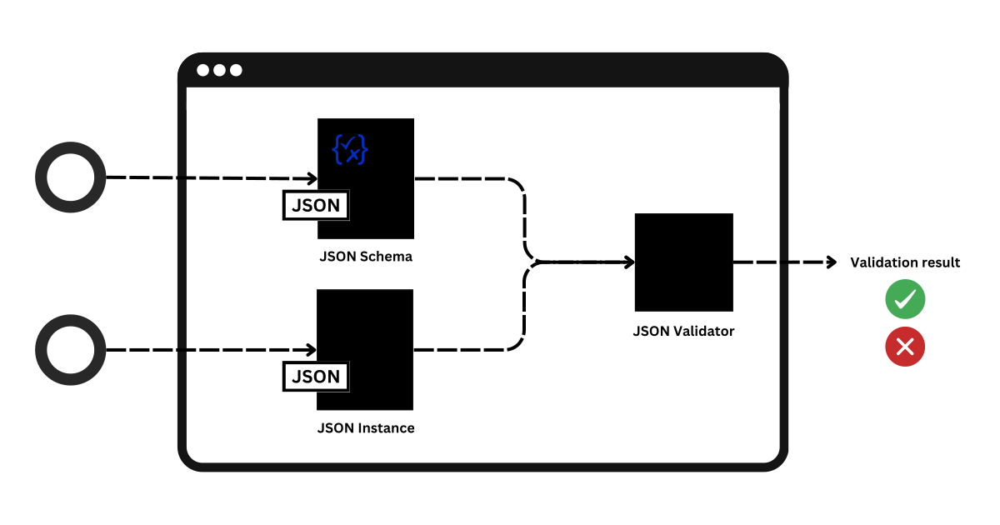

- [最初のスキーマを定義する](#最初のスキーマを定義する)
  - [概要](#概要)
  - [JSONスキーマの紹介](#jsonスキーマの紹介)
  - [スキーマ定義を作成する](#スキーマ定義を作成する)
  - [プロパティを定義する](#プロパティを定義する)
    - [プロパティオブジェクトを追加する](#プロパティオブジェクトを追加する)
    - [Null 許容プロパティの定義](#null-許容プロパティの定義)
    - [必須プロパティの定義](#必須プロパティの定義)
    - [オプションのプロパティを定義する](#オプションのプロパティを定義する)
  - [ネストされたデータ構造を作成する](#ネストされたデータ構造を作成する)
  - [外部参照の追加](#外部参照の追加)
  - [スキーマに対して JSON データを検証する](#スキーマに対して-json-データを検証する)
  - [参考資料](#参考資料)


# 最初のスキーマを定義する

JSON スキーマは、JSON ドキュメントに注釈を付けて検証するために使用できる語彙です。このチュートリアルでは、JSON スキーマの作成手順を説明します。

JSON スキーマを作成したら、選択した言語の検証ツールを使用して、スキーマに対してサンプル データを検証できます。 [ツール](https://json-schema.org/tools?query=&sortBy=name&sortOrder=ascending&groupBy=toolingTypes&licenses=&languages=&drafts=&toolingTypes=&environments=) にアクセスして、ニーズに合った検証を選択してください。

JSON スキーマの作成方法をすでに知っていて、スキーマ生成、コード生成、ドキュメント、UI 生成、JSON スキーマ処理または変換などのさまざまな JSON スキーマの使用例を探している場合は、 [ツール](https://json-schema.org/tools?query=&sortBy=name&sortOrder=ascending&groupBy=toolingTypes&licenses=&languages=&drafts=&toolingTypes=&environments=) にアクセスして、JSON スキーマ エコシステムで利用できる優れたツールを調べてください。


## 概要

このガイドで使用する例は、次のような JSON オブジェクトを使用してデータを保存する製品カタログです。

```json
{
  "productId": 1,
  "productName": "A green door",
  "price": 12.50,
  "tags": [ "home", "green" ]
}
```

カタログ内の各製品には次のものが含まれます。

- productId: 製品の識別子
- productName: 製品名
- price: 消費者の負担
- tags: 識別タグのオプションの配列

JSON オブジェクトは人間が判読可能ですが、コンテキストやメタデータは含まれていません。オブジェクトを見ても、キーの意味や可能な入力が何であるかを判断する方法はありません。JSON スキーマは、これらの質問に対する回答を提供するための標準です。このガイドでは、JSON データ セットの構造、制約、およびデータ型を記述する JSON スキーマ ドキュメントを作成します。


## JSONスキーマの紹介

**インスタンス** は、検証または記述される JSON ドキュメントであり、 **スキーマ** は、その詳細を含むドキュメントです。

最も基本的なスキーマは、何も制約せず、何でも許可し、何も記述しない空の JSON オブジェクトです。

```json
{}
```

スキーマに検証キーワードを追加することで、インスタンスに制約を適用できます。たとえば、typeキーワードを使用して、インスタンスを以下のいずれかに制限できます。

- オブジェクト
- 配列
- 文​​字列
- 数値
- ブール値
- null 

```json
{ "type": "string" }
```

JSON スキーマはハイパーメディア対応で、既存の JSON ベースの HTTP API に注釈を付けるのに最適です。JSON スキーマ ドキュメントは URI によって識別され、HTTP リンク ヘッダーや JSON スキーマ ドキュメント内で使用して再帰的な定義が可能になります。


## スキーマ定義を作成する

基本的なスキーマ定義を作成するには、次のキーワードを定義します。

- $schema: スキーマが準拠する JSON スキーマ標準のドラフトを指定します。
- $id: このスキーマの URI を設定します。この一意の URI を使用して、同じドキュメント内または外部の JSON ドキュメントから、このスキーマの要素を参照できます。
- titleおよびdescription: はスキーマの意図を述べます。これらのキーワードは、検証されるデータに制約を追加しません。
- type: JSON データの最初の制約を定義します。以下の製品カタログの例では、このキーワードはデータが JSON オブジェクトである必要があることを指定します。

例えば：

```json
{
  "$schema": "https://json-schema.org/draft/2020-12/schema",
  "$id": "https://example.com/product.schema.json",
  "title": "Product",
  "description": "A product in the catalog",
  "type": "object"
}
```

キーワードは JSON キーを使用して定義されます。通常、検証されるデータは JSON データ ドキュメントに含まれていますが、JSON スキーマは、テキストや XML ファイルなどの、他のコンテンツ タイプに含まれる JSON データも検証できます。

JSON Schema の用語では、 `$schema` と `$id` は [スキーマ キーワード](https://json-schema.org/draft/2020-12/json-schema-core.html#section-8.1.1) 、 `title` と `description` は [スキーマ注釈](https://json-schema.org/draft/2020-12/json-schema-validation.html#section-9.1) 、 `type` は [検証キーワード](https://json-schema.org/draft/2020-12/json-schema-validation.html#section-6.1.1) です。


## プロパティを定義する

このセクションで properties は、キーワードを追加します。 JSON スキーマの用語では、 properties は [検証キーワード](https://json-schema.org/draft/2020-12/json-schema-core.html#section-10.3.2.1) です。 properties を定義すると、各プロパティが検証対象の JSON データ内のキーを表すオブジェクトが作成されます。オブジェクトで定義されているプロパティのうち必須のものを指定することもできます。


### プロパティオブジェクトを追加する

製品カタログの例では、productId製品を一意に識別する数値です。これは製品の正規の識別子であるため、必須です。

propertiesオブジェクトをスキーマに追加するには:

1. propertiesスキーマの末尾に検証キーワードを追加します。

```json
...
  "title": "Product",
  "description": "A product from Acme's catalog",
  "type": "object",
  "properties": {
    "productId": {}
  }
```


2. 次のスキーマ注釈とともに productId キーワードを追加します。

- description: productId が何であるかを説明します。この場合、製品の一意の識別子です。
- type: どのような種類のデータが期待されるかを定義します。この例では、製品識別子は数値なので、 integer を使用します。


```json
...
  "properties": {
    "productId": {
      "description": "The unique identifier for a product",
      "type": "integer"
    }
  }
```

新しいproperties検証キーワードを使用すると、全体的なスキーマは次のようになります。

```json
{
  "$schema": "https://json-schema.org/draft/2020-12/schema",
  "$id": "https://example.com/product.schema.json",
  "title": "Product",
  "description": "A product from Acme's catalog",
  "type": "object",
  "properties": {
    "productId": {
      "description": "The unique identifier for a product",
      "type": "integer"
    }
  }
}

```

次の例では、別の必須キー productName を追加します。この値は文字列です。

```json
{
  "$schema": "https://json-schema.org/draft/2020-12/schema",
  "$id": "https://example.com/product.schema.json",
  "title": "Product",
  "description": "A product from Acme's catalog",
  "type": "object",
  "properties": {
    "productId": {
      "description": "The unique identifier for a product",
      "type": "integer"
    },
    "productName": {
      "description": "Name of the product",
      "type": "string"
    }
  }
}
```

これで、properties オブジェクトに productId と productName の 2 つのキーが含まれるようになりました。JSON データがこのスキーマに対して検証されると、これらのいずれかのフィールドに無効なデータが含まれているドキュメントの検証は失敗します。


### Null 許容プロパティの定義

次のセクションで説明する [必須プロパティの定義](#必須プロパティの定義) や [オプションのプロパティの定義](#オプションのプロパティを定義する) は、プロパティ自体が JSON 内に存在する必要があるかどうかの話ですが、このセクションでは、プロパティの値に null が許容されるか、されないかについての設定方法を説明します。

次の例では、 name プロパティが null 許容であることを示します。 name プロパティには、 null 、もしくは、 String 型のデータが格納可能です。

```json
{
  "type": "object",
  "properties": {
    "name": {
      "type": ["string", "null"]
    }
  },
  "required": ["name"]
}
```


### 必須プロパティの定義

このセクションでは、特定のプロパティが必須であることを指定する方法について説明します。この例では、既存の 2 つのキーを必須にし、price という別の必須キーを追加します。price キーには、他のキーと同様に説明とタイプがありますが、最小値も指定します。ストアには無料のものは何もありませんので、各製品には 0 より大きい価格値が必要です。exclusiveMinimum 検証キーワードを使用してこれを定義します。

必須プロパティを定義するには:

1. properties オブジェクト内に price キーを追加します。通常のスキーマ注釈の description と type を含めます。 type は数値です。

```json
  "properties": {
    ...
    "price": {
      "description": "The price of the product",
      "type": "number"
    }
  }
```

2. exclusiveMinimum 検証キーワードを追加し、値を 0 に設定します。

```json
  "price": {
    "description": "The price of the product",
    "type": "number",
    "exclusiveMinimum": 0
  }
```

3. required 検証キーワードを、スキーマの末尾、 properties オブジェクトの後に追加します。 productID 、 productName 、および新しい price キーを配列に追加します。これで、これらのプロパティは、必須プロパティとなりました。

```json
  ...

  "properties": {
    ...

    "price": {
      "description": "The price of the product",
      "type": "number",
      "exclusiveMinimum": 0
    }
  },
  "required": [
    "productId",
    "productName",
    "price"
  ]

```

新しい required キーワードと price キーを使用すると、全体的なスキーマは次のようになります。

```json
{
  "$schema": "https://json-schema.org/draft/2020-12/schema",
  "$id": "https://example.com/product.schema.json",
  "title": "Product",
  "description": "A product from Acme's catalog",
  "type": "object",
  "properties": {
    "productId": {
      "description": "The unique identifier for a product",
      "type": "integer"
    },
    "productName": {
      "description": "Name of the product",
      "type": "string"
    },
    "price": {
      "description": "The price of the product",
      "type": "number",
      "exclusiveMinimum": 0
    }
  },
  "required": [ "productId", "productName", "price" ]
}

```

`exclusiveMinimum` 検証キーワードは、ゼロより大きい値のみが有効と見なされます。ゼロを有効なオプションとして含めるには、代わりに `minimum` 検証キーワードを使用できます。


### オプションのプロパティを定義する

このセクションでは、オプションのプロパティを定義する方法について説明します。この例では、次の条件を使用して tags という名前のキーワードを定義します。

- tags キーワードはオプションです。
- tags が含まれる場合、少なくとも 1 つの項目が含まれている必要があります。
- すべてのタグは一意である必要があります。
- すべてのタグはテキストである必要があります。

オプションのプロパティを定義するには:

1. properties オブジェクト内に tags キーワードを追加します。通常のスキーマ注釈の description と type を含め、 type を配列として定義します。

```json
  ...

  "properties": {
    ...

    "tags": {
      "description": "Tags for the product",
      "type": "array"
    }
  }
```

2. 配列に表示される内容を定義するために、新しい `items` 検証キーワードを追加します。たとえば、文字列は次のようになります。

```json
  ...

  "tags": {
    "description": "Tags for the product",
    "type": "array",
    "items": {
      "type": "string"
    }
  }
```

3. 配列に少なくとも 1 つの項目があることを確認するには、minItems 検証キーワードを使用します。

```json
  ...

  "tags": {
    "description": "Tags for the product",
    "type": "array",
    "items": {
      "type": "string"
    },
    "minItems": 1
  }

```

4. 配列内のすべての項目が一意であることを確認するには、uniqueItems 検証キーワードを使用して true に設定します。

```json
  ...

  "tags": {
    "description": "Tags for the product",
    "type": "array",
    "items": {
      "type": "string"
    },
    "minItems": 1,
    "uniqueItems": true
  }
```

新しい tags キーワードを使用すると、全体的なスキーマは次のようになります。

```json
{
  "$schema": "https://json-schema.org/draft/2020-12/schema",
  "$id": "https://example.com/product.schema.json",
  "title": "Product",
  "description": "A product from Acme's catalog",
  "type": "object",
  "properties": {
    "productId": {
      "description": "The unique identifier for a product",
      "type": "integer"
    },
    "productName": {
      "description": "Name of the product",
      "type": "string"
    },
    "price": {
      "description": "The price of the product",
      "type": "number",
      "exclusiveMinimum": 0
    },
    "tags": {
      "description": "Tags for the product",
      "type": "array",
      "items": {
        "type": "string"
      },
      "minItems": 1,
      "uniqueItems": true
    }
  },
  "required": [ "productId", "productName", "price" ]
}
```

新しいキーワードは必須ではないため、 required セクションに変更はありません。


## ネストされたデータ構造を作成する

前の例では、1 つのレベルのみを持つフラット スキーマについて説明しました。このセクションでは、JSON スキーマでネストされたデータ構造を使用する方法について説明します。

ネストされたデータ構造を作成するには:

1. properties オブジェクト内に、 `dimensions` という新しいキーを作成します。

```json
  ...

  "properties": {
    ...

    "dimensions": {}
  }
```

2. type 検証キーワードを object として定義します。

```json
  ...

  "dimensions": {
    "type": "object"
  }
```

3. ネストされたデータ構造を含めるには、 properties 検証キーワードを追加します。新しい properties キーワード内に、 length 、 width 、 height のキーワードを追加します。これらは、全て number 型とします。

```json
  ...

  "dimensions": {
    "type": "object",
    "properties": {
      "length": {
        "type": "number"
      },
      "width": {
        "type": "number"
      },
      "height": {
        "type": "number"
      }
    }
  }
```

1. これらの各プロパティを必須にするには、 dimensions オブジェクト内に required 検証キーワードを追加します。

```json
  ...

  "dimensions": {
    "type": "object",
    "properties": {
      "length": {
        "type": "number"
      },
      "width": {
        "type": "number"
      },
      "height": {
        "type": "number"
      }
    },
    "required": [
      "length",
      "width",
      "height"
    ]
  }
```

新しいネストされたデータ構造を使用すると、全体的なスキーマは次のようになります。

```json
{
  "$schema": "https://json-schema.org/draft/2020-12/schema",
  "$id": "https://example.com/product.schema.json",
  "title": "Product",
  "description": "A product from Acme's catalog",
  "type": "object",
  "properties": {
    "productId": {
      "description": "The unique identifier for a product",
      "type": "integer"
    },
    "productName": {
      "description": "Name of the product",
      "type": "string"
    },
    "price": {
      "description": "The price of the product",
      "type": "number",
      "exclusiveMinimum": 0
    },
    "tags": {
      "description": "Tags for the product",
      "type": "array",
      "items": {
        "type": "string"
      },
      "minItems": 1,
      "uniqueItems": true
    },
    "dimensions": {
      "type": "object",
      "properties": {
        "length": {
          "type": "number"
        },
        "width": {
          "type": "number"
        },
        "height": {
          "type": "number"
        }
      },
      "required": [ "length", "width", "height" ]
    }
  },
  "required": [ "productId", "productName", "price" ]
}
```

新しく追加した required 検証キーワードは、 dimensions キーの範囲内でのみ適用されます。


## 外部参照の追加

このセクションでは、スキーマの外部のリソースを参照する方法について説明します。多くのデータ構造間でスキーマを共有することは、スキーマの使用、読み取り、および最新の状態への維持を容易にするための一般的な方法です。これまでのところ、製品カタログ スキーマは自己完結型です。このセクションでは、新しいスキーマを作成し、それを製品カタログ スキーマで参照します。

次のスキーマは、地理的な場所を検証します。

```json
{
  "$id": "https://example.com/geographical-location.schema.json",
  "$schema": "https://json-schema.org/draft/2020-12/schema",
  "title": "Longitude and Latitude",
  "description": "A geographical coordinate on a planet (most commonly Earth).",
  "required": [ "latitude", "longitude" ],
  "type": "object",
  "properties": {
    "latitude": {
      "type": "number",
      "minimum": -90,
      "maximum": 90
    },
    "longitude": {
      "type": "number",
      "minimum": -180,
      "maximum": 180
    }
  }
}
```

製品カタログ スキーマから、このスキーマを参照するには:

1. properties オブジェクト内に、warehouseLocation というキーを追加します:

```json
  ...

  "properties": {
    ...

    "warehouseLocation": {}
  }
```

2. 外部の地理的位置スキーマにリンクするには、 `$ref` スキーマ キーワードとスキーマ URL を追加します。 `$ref` キーワードの値には、地理的位置スキーマの `$id` に定義された値を指定します。

```json
  ...

  "warehouseLocation": {
    "description": "Coordinates of the warehouse where the product is located.",
    "$ref": "https://example.com/geographical-location.schema.json"
  }
```

外部スキーマ参照を使用すると、全体的なスキーマは次のようになります。

```json
{
  "$schema": "https://json-schema.org/draft/2020-12/schema",
  "$id": "https://example.com/product.schema.json",
  "title": "Product",
  "description": "A product from Acme's catalog",
  "type": "object",
  "properties": {
    "productId": {
      "description": "The unique identifier for a product",
      "type": "integer"
    },
    "productName": {
      "description": "Name of the product",
      "type": "string"
    },
    "price": {
      "description": "The price of the product",
      "type": "number",
      "exclusiveMinimum": 0
    },
    "tags": {
      "description": "Tags for the product",
      "type": "array",
      "items": {
        "type": "string"
      },
      "minItems": 1,
      "uniqueItems": true
    },
    "dimensions": {
      "type": "object",
      "properties": {
        "length": {
          "type": "number"
        },
        "width": {
          "type": "number"
        },
        "height": {
          "type": "number"
        }
      },
      "required": [ "length", "width", "height" ]
    },
    "warehouseLocation": {
      "description": "Coordinates of the warehouse where the product is located.",
      "$ref": "https://example.com/geographical-location.schema.json"
    }
  },
  "required": [ "productId", "productName", "price" ]
}
```

## スキーマに対して JSON データを検証する

JSON スキーマができたので、 [JSON スキーマ バリデーター](https://json-schema.org/tools?query=&sortBy=name&sortOrder=ascending&groupBy=toolingTypes&licenses=&languages=&drafts=&toolingTypes=validator) を使用して、 [JSON データ](https://json-schema.org/learn/glossary#instance) をスキーマに対して検証します。

バリデーターは、JSON スキーマ仕様を実装するツールです。すべてのバリデーターは同じように動作します。つまり、JSON スキーマと JSON インスタンスを入力として受け取り、検証結果を出力として返します。



自分で試してみるには、 [ツール](https://json-schema.org/tools#validators) にアクセスして、ニーズに合った検証ツールを選択してください。または、 [公式サイト上のエディター](https://json-schema.org/learn/getting-started-step-by-step#validate-json-data-against-the-schema) を使用して、さまざまなスキーマとインスタンスを調べ、さまざまな検証結果を確認してください。


## 参考資料

- [JSON Schema キーワード一覧](https://json-schema.org/understanding-json-schema/keywords)


