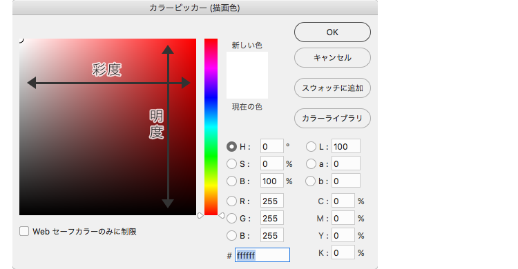
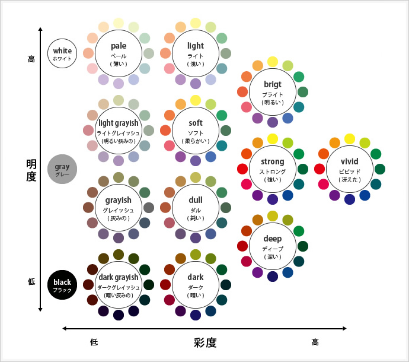
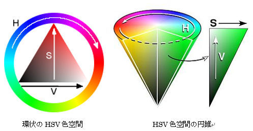

<!-- TOC depthFrom:1 depthTo:6 withLinks:1 updateOnSave:1 orderedList:0 -->

- [色](#色)
	- [RGB](#rgb)
		- [概要](#概要)
	- [加法混色](#加法混色)
		- [概要](#概要-1)
	- [色の三属性](#色の三属性)
	- [色相](#色相)
		- [概要](#概要-2)
	- [彩度](#彩度)
		- [概要](#概要-3)
	- [明度](#明度)
		- [概要](#概要-4)
	- [GoogleColorPicker（と同じ表現方法のpicker）](#googlecolorpickerと同じ表現方法のpicker)
	- [トーン](#トーン)
	- [HSV色空間](#hsv色空間)
	- [RGB表現のポイント](#rgb表現のポイント)

<!-- /TOC -->

# 色

## RGB

### 概要
- R(赤)、G(緑)、B(青)の三色の組み合わせで色を表現する方法のこと。
- それぞれの要素が、一桁もしくは二桁の16進数（00～FF）で表現される。

## 加法混色

### 概要
- R(赤)、G(緑)、B(青)を混ぜると白っぽくなり、減らすと黒っぽくなる色の混合法則のこと。
- ディスプレイなど自ら光を発するものが色を表現する際にはこの法則にしたがう。

## 色の三属性

色の三属性には、 **色相、彩度、明度** があります。

## 色相

### 概要

- 黒っぽさ、白っぽさが全くない、いわゆる原色を連続的に表現したもののこと。
- 360度の環状で表現したり、0～100の棒状で表現される。
- 彩度と明度が最も高い色である。

## 彩度

### 概要

- 有彩色（白黒以外の色味のある色）の注入率のこと。
- 彩度が高いと色味がはっきりとわかり、低いと色味が薄くなり白っぽさ黒っぽさが強調される。

## 明度

### 概要

- 黒色の注入率のこと。
- 黒っぽさの度合いを表す。

## GoogleColorPicker（と同じ表現方法のpicker）

- 横軸
  - 彩度を表す。
  - 左にいくほど彩度が落ち、RGBは明彩調整色と色相調整色が色相ベース色の値に近づく。
- 縦軸
  - 明度を表す。
	- 下にいくほど明度が落ち、RGBは `000000` に近づく。
- スライドバー
  - 色相を表す
  - なお、スライドバーは常に長方形の領域の一番右上の色を表している。
	- RGBのうち二つの要素（色相ベース色、色相調整色）によって色が決まる。残りの要素（明彩調整色）は常に`00`である。
  	- 用語については、当ドキュメントの一番下を参照してください。

## トーン

トーンとは、このうちの明度と彩度をあわせた考え方で、【明度と彩度が似ている色を集めてグループ化したもの】をトーンと呼びます。

## HSV色空間

この図は彩度、明度の関係が三角形で表されているので、RGBと彩度・明度の関係が曖昧なので、正確な関係はGoogleColorPicker を参考にすること。

## RGB表現のポイント

- 色相に表現される色はすべてR、G、Bのいずれかの色に`00`と`FF`を含んでおり、残りの一つが`00～FF`までの値をとる。
  - ここでは仮に以下のように命名する
    - `00`の色を明彩調整色（彩度、明度を調整するためだけの役割を持つ）
    - `FF`の色を色相ベース色（色相を決定するときのベース色の役割がある）
    - `00～FF`の色を色相調整色（色相を決定するときにベース色に混ぜ合わせて色を調整する役割があるため）
    - 色相で表現されている色を原色
- 彩度が一番高い色はどんな色でも色相の明彩調整色が`00`である。
- 彩度が一番低い色はどんな色でもRGBの各要素の値が同じである。
- 明度が一番高い色はどんな色でも色相の色相ベース色が常に`FF`である。
- 明度が一番低い色はどんな色でも常に`000000`である。
